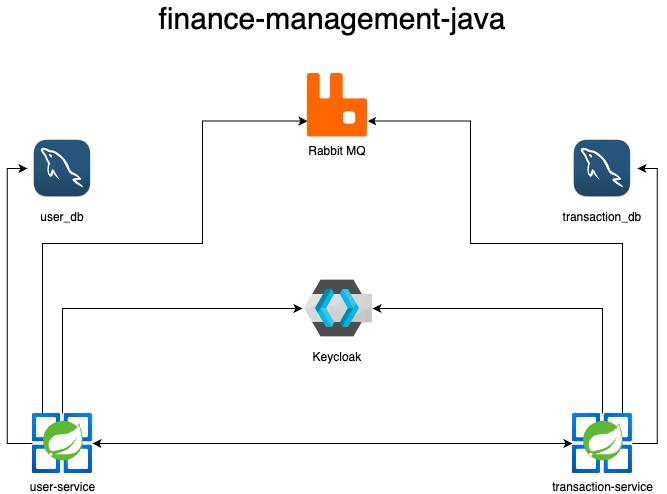

# Finance Management Java

User Service API - Api RESTful para gestão de usuários.

[](https://sonarcloud.io/summary/new_code?id=souluanf_finance-management-java-user)
[](https://sonarcloud.io/summary/new_code?id=souluanf_finance-management-java-user)
[](https://sonarcloud.io/summary/new_code?id=souluanf_finance-management-java-user)
[](https://sonarcloud.io/summary/new_code?id=souluanf_finance-management-java-user)
[](https://sonarcloud.io/summary/new_code?id=souluanf_finance-management-java-user)
[](https://sonarcloud.io/summary/new_code?id=souluanf_finance-management-java-user)
[](https://sonarcloud.io/summary/new_code?id=souluanf_finance-management-java-user)
[](https://sonarcloud.io/summary/new_code?id=souluanf_finance-management-java-user)
[](https://sonarcloud.io/summary/new_code?id=souluanf_finance-management-java-user)
[](https://sonarcloud.io/summary/new_code?id=souluanf_finance-management-java-user)
[](https://sonarcloud.io/summary/new_code?id=souluanf_finance-management-java-user)

Transaction Service API - Api RESTful para gestão de transações.

[](https://sonarcloud.io/summary/new_code?id=souluanf_finance-management-java-transaction)
[](https://sonarcloud.io/summary/new_code?id=souluanf_finance-management-java-transaction)
[](https://sonarcloud.io/summary/new_code?id=souluanf_finance-management-java-transaction)
[](https://sonarcloud.io/summary/new_code?id=souluanf_finance-management-java-transaction)
[](https://sonarcloud.io/summary/new_code?id=souluanf_finance-management-java-transaction)
[](https://sonarcloud.io/summary/new_code?id=souluanf_finance-management-java-transaction)
[](https://sonarcloud.io/summary/new_code?id=souluanf_finance-management-java-transaction)
[](https://sonarcloud.io/summary/new_code?id=souluanf_finance-management-java-transaction)
[](https://sonarcloud.io/summary/new_code?id=souluanf_finance-management-java-transaction)
[](https://sonarcloud.io/summary/new_code?id=souluanf_finance-management-java-transaction)
[](https://sonarcloud.io/summary/new_code?id=souluanf_golden-raspberry-awards-api)

## Sumário

- [Funcionalidades](#funcionalidades)
- [Requisitos](#requisitos)
- [Configuração](#configuração)
- [Execução](#execução)
    - [Executando a Aplicação com Maven](#executando-a-aplicação-com-maven)
    - [Executando a Aplicação com Docker Compose](#executando-a-aplicação-com-docker-compose)
- [Acesso ao Banco de Dados](#acesso-ao-banco-de-dados)
    - [Credenciais](#credenciais)
- [Contato](#contato)

## Requisitos

- JDK 21
- Maven 3.6+
- Docker

## Configuração

**Instalação do JDK, Maven e Docker:**

- [Instruções para instalação do JDK](https://docs.oracle.com/en/java/javase/21/install/overview-jdk-installation.html)
- [Instruções para instalação do Maven](https://maven.apache.org/install.html)
- [Instruções para instalação do Docker](https://docs.docker.com/get-docker/)

## Execução

### Executando a Aplicação com Docker Compose

Copie as variáveis utilizadas

```bash
cp .env.docker .env
```

Execute o comando abaixo:

```bash
docker-compose up -d
```

### Acesso à Documentação

#### Postman (preferência)
Ambas as collections estão no diretório `collections`:
[collections](collections)

Importe ambas as collections para o Postman e teste os serviços

#### OpenAPI

- **User OpenApi UI:** [http://localhost:8081/user-service](http://localhost:8081/user-service)
- **Transaction OpenApi UI**: [http://localhost:8082/transaction-service](http://localhost:8082/transaction-service)

### Credenciais

#### Serviços

| **Serviço** |   **URL**   | **Username** | **Password** | **Database** | **Port** |
|:-----------:|:-----------:|:------------:|:------------:|:------------:|:--------:|
|   `MySQL`   | `localhoat` | `finance_db` | `finance_db` | `finance_db` |  `3306`  |
| `Rabbit MQ` | `localhoat` |  `rabbitmq`  |  `rabbitmq`  |  `rabbitmq`  | `15672`  |

#### Auth

| **Username** | **Password** |
|:------------:|:------------:|
|   `admin`    |   `admin`    |

## Desenho da solução



## Contato

Para suporte ou feedback:

- **Nome:** Luan Fernandes
- **Email:**  [contact@luanfernandes.dev](mailto:contact@luanfernandes.dev)
- **Website:** [https://luanfernandes.dev](https://luanfernandes.dev)
- **LinkedIn:** [https://linkedin.com/in/souluanf](https://linkedin.com/in/souluanf)